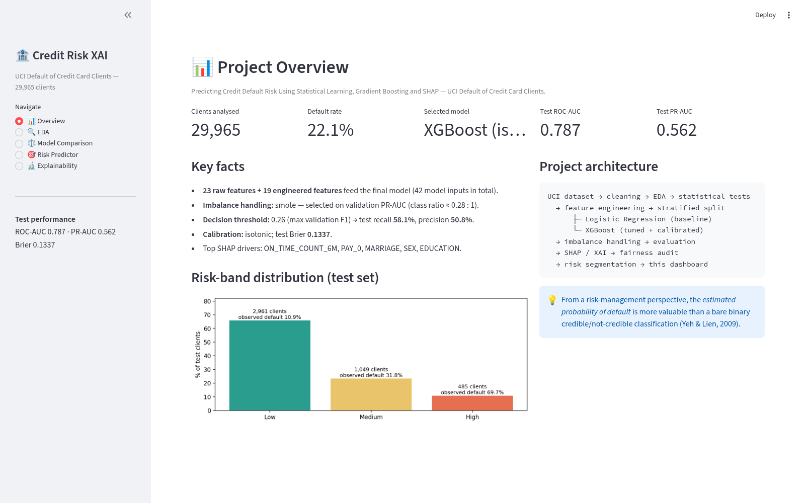
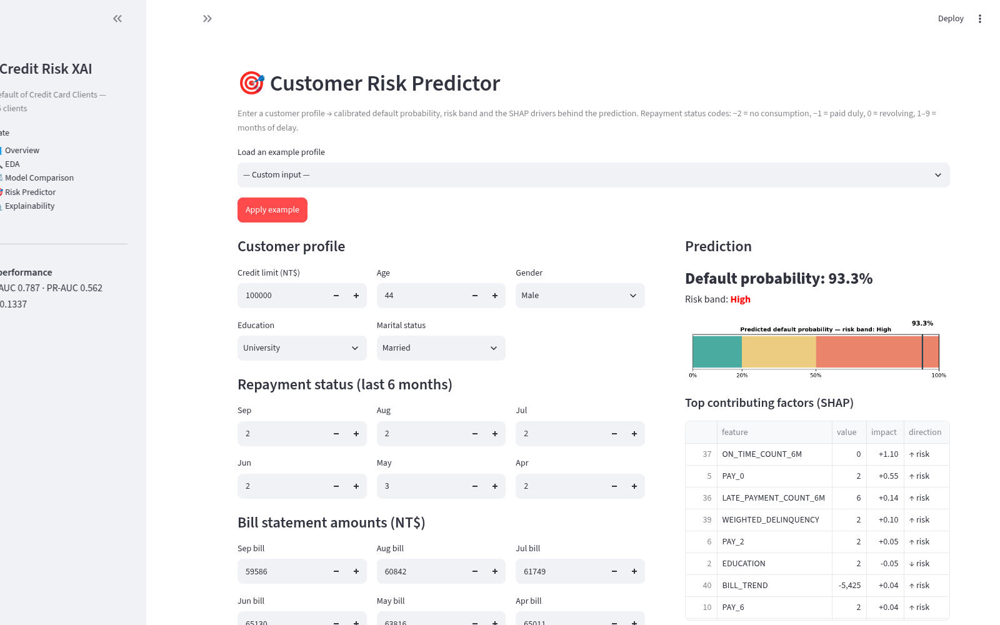
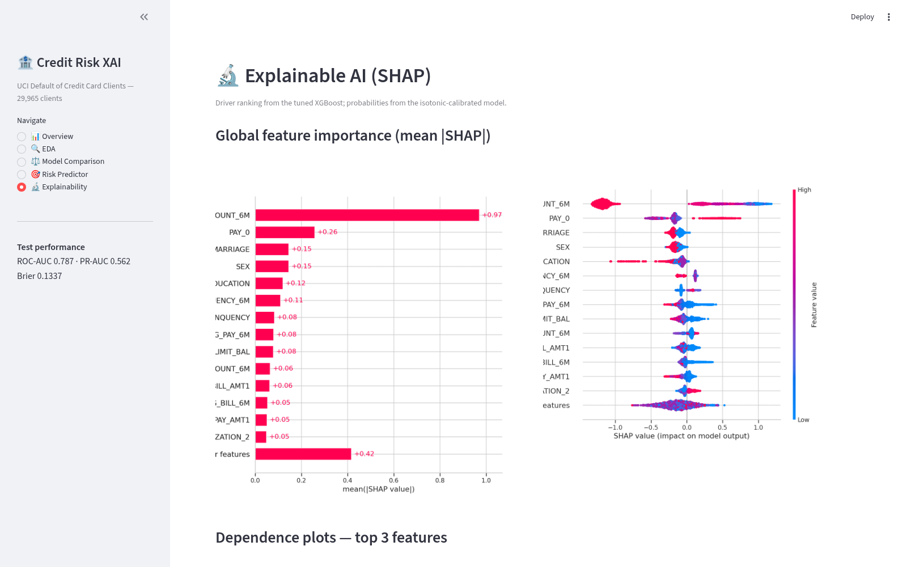

# Credit Risk Prediction & Explainable AI

[](https://github.com/avikroyarghya/credit-risk-xai/actions/workflows/ci.yml)
[](LICENSE)
[](https://www.python.org/)
[](reports/eval_summary.json)
[](reports/eval_summary.json)
[](audit.py)

**Predicting Credit Default Risk Using Statistical Learning, Gradient Boosting and SHAP**

An end-to-end, statistics-first data science project on the UCI *Default of Credit
Card Clients* dataset: data understanding → EDA → formal hypothesis testing →
feature engineering → interpretable and ensemble models → imbalance handling →
hyperparameter tuning → probability calibration → SHAP explainability → fairness
audit → risk segmentation → an interactive Streamlit dashboard.

> 🔗 **Live repository:** https://github.com/avikroyarghya/credit-risk-xai
> Every push is verified by **GitHub Actions CI**, which re-runs the complete
> 7-stage pipeline from scratch (UCI download → models → SHAP) and the
> independent **98-check audit** — see the badge above.

### Dashboard preview

| Overview | Risk Predictor | Explainability |
|:---:|:---:|:---:|
|  |  |  |

Run it yourself: `streamlit run app/app.py` (requires the artifacts generated by
`python run_all.py`).

---

## 1. Problem Statement

Financial institutions need to estimate the probability that a borrower will
default. The objective of this project is to build and evaluate predictive models
for credit default risk and to explain the factors contributing to individual
predictions.

* **Target:** will the customer default on their credit-card payment next month?
  * `0` = No default, `1` = Default
* **Framing:** binary classification **and** risk *probability estimation* — from a
  risk-management perspective the estimated probability of default is more valuable
  than a bare credible / not-credible classification (Yeh & Lien, 2009).
* **Explainability requirement:** every prediction must be auditable — global
  drivers (SHAP) and per-customer waterfalls — as expected in a credit-risk setting.

## 2. Dataset

**UCI Machine Learning Repository — [Default of Credit Card Clients](https://archive.ics.uci.edu/dataset/350/default+of+credit+card+clients)**
(30,000 clients, 23 predictive features, binary target, no missing values;
CC BY 4.0; classified as a business / credit-risk dataset).

> Yeh, I. C., & Lien, C. H. (2009). *The comparisons of data mining techniques for
> the predictive accuracy of probability of default of credit card clients.*
> Expert Systems with Applications, 36(2), 2473–2480.

This dataset was deliberately chosen over larger alternatives (e.g. Home Credit,
~2.68 GB) as the Phase-1 project: it is manageable, academically credible and rich
enough to cover statistics, ML, feature engineering, evaluation, XAI and fairness
in one coherent project.

**Data quality actions**

| Check | Result | Action |
|---|---|---|
| Missing values | 0 cells | — |
| Duplicate rows | 35 | dropped → 29,965 clients |
| Undocumented `EDUCATION` codes 0/5/6 | 345 rows | grouped into `4` (Others) |
| Undocumented `MARRIAGE` code 0 | 54 rows | grouped into `3` (Others) |
| Logical consistency (bill/payment signs, status ranges) | OK | — |
| Conflicting twin profiles (identical features, opposite target) | 21 pairs (42 rows) | kept — distinct clients, genuine aleatoric uncertainty; no leakage possible (see `data/README.md`) |

**Variable dictionary**

| Variable | Meaning | Type |
|---|---|---|
| `LIMIT_BAL` | Credit limit (NT$) | Continuous |
| `SEX` | Gender code (1 = male, 2 = female) | Categorical |
| `EDUCATION` | Education category (1 = grad school … 4 = others) | Categorical |
| `MARRIAGE` | Marital status (1 = married, 2 = single, 3 = others) | Categorical |
| `AGE` | Age (years) | Continuous |
| `PAY_0` … `PAY_6` | Repayment status Sep → Apr (−2 = no consumption, −1 = paid duly, 0 = revolving, 1–9 = months delayed) | Ordinal |
| `BILL_AMT1` … `BILL_AMT6` | Monthly bill statement (NT$) | Continuous |
| `PAY_AMT1` … `PAY_AMT6` | Previous payment (NT$) | Continuous |
| `default` | Default next month (0/1) | Binary |

## 3. Research Questions

1. Which borrower and repayment characteristics are statistically associated with
   default?
2. How much predictive improvement do tree-based models provide over logistic
   regression?
3. Which features drive *individual* default-risk predictions — and can the model's
   output be used as a calibrated risk probability for segmentation?

## 4. Methodology

```
UCI dataset (30,000)
   ↓  download → data/raw (never manually edited)
Data cleaning  (dupes, undocumented categories)        → 29,965 clients
   ↓
EDA  (univariate / bivariate / target analysis)
   ↓
Statistical analysis  (χ², Welch t, Mann–Whitney U, Cramér's V, Cohen's d)
   ↓
Feature engineering  (utilization, delinquency, ratios, trends)  → 42 model inputs
   ↓
Stratified split  70% train / 15% validation / 15% test  (test untouched until the end)
   ↓
Baselines: Dummy · Logistic Regression
Advanced:  Decision Tree · Random Forest · XGBoost
   ↓
Imbalance handling (none vs class-weight vs SMOTE — decided on validation PR-AUC)
Hyperparameter tuning (RandomizedSearchCV, 15×3-fold, average precision)
   ↓
Probability calibration (sigmoid vs isotonic — decided on validation Brier)
   ↓
Test-set evaluation (ROC/PR-AUC, F1, confusion matrix, threshold tuning)
   ↓
Explainable AI (SHAP global + local)  ·  Fairness audit  ·  Risk segmentation
   ↓
Streamlit dashboard (5 pages)
```

Every modelling decision (imbalance strategy, hyperparameters, calibration method,
decision threshold) was selected using **training / validation data only**; the test
set was scored once at the very end. SMOTE is applied strictly inside the training
routine — never across the split boundary.

## 5. Exploratory Data Analysis (highlights)

Full figure set: `reports/figures/` (regenerate with `python -m src.eda`).

| Finding | Evidence |
|---|---|
| Default rate is **22.1%** (6,636 / 29,965) — moderately imbalanced | `01_target_distribution` |
| Recent repayment status dominates risk: paid-duly → 16.8% default; **2-month delay → 69.1%** | `07_repayment_status` |
| Association strength decays with recency: Sep Cramér's V 0.42 → Apr 0.25 | `08_repayment_heatmap`, `14_stat_effect_sizes` |
| Higher credit limit ⇒ lower default rate (monotone across deciles) | `13_limit_decile_default` |
| Education: high school 25.2% > university 23.7% > graduate school 19.2% | `06_categorical_default_rates` |
| Bills are highly inter-correlated (r ≈ 0.8–0.9 across months) | `12_correlation_heatmap` |


## 6. Statistical Findings

*Hypothesis tests with effect sizes (n = 29,965; α = 0.05). Full table:
`reports/statistical_tests.csv`.*

| Hypothesis | Test | p-value | Effect size | Verdict |
|---|---|---|---|---|
| H1: repayment status (Sep) associated with default | χ² independence | < 10⁻³⁰⁰ | **Cramér's V = 0.42** | Large association |
| H1 (recency gradient): Apr status | χ² independence | < 10⁻³⁰⁰ | Cramér's V = 0.25 | Medium, weaker |
| H2: credit limit differs between groups | Welch t + MWU | ≈ 10⁻¹⁹⁰ | **Cohen's d = −0.38** | Small–medium, meaningful |
| H3: age differs between groups | Welch t + MWU | 0.023 | **Cohen's d = 0.03** | Significant p, *negligible* effect |
| Gender vs default | χ² | 6.6 × 10⁻¹² | Cramér's V = 0.04 | Very weak |
| Education vs default | χ² | 1.5 × 10⁻³⁴ | Cramér's V = 0.07 | Weak |

**Lesson worth stating explicitly:** age is "statistically significant" at n = 30k
while being practically irrelevant (d = 0.03). Reporting effect sizes and
confidence intervals alongside p-values is what separates a statistics project
from an accuracy print-out.

## 7. Feature Engineering

19 behavioural features derived from the 23 raw variables (all row-wise → safe to
apply to a single applicant at inference time):

| Feature | Definition | Intuition |
|---|---|---|
| `UTILIZATION_1..6`, `_MAX`, `_MEAN` | `BILL_AMTi / LIMIT_BAL` | credit stress |
| `AVG_BILL_6M`, `AVG_PAY_6M`, `TOTAL_PAY_6M` | 6-month averages | exposure & behaviour |
| `PAY_TO_BILL_RATIO` | `AVG_PAY_6M / AVG_BILL_6M` (guarded, clipped) | repayment effort |
| `LATE_PAYMENT_COUNT_6M`, `ON_TIME_COUNT_6M` | months with / without delay | behaviour pattern |
| `MAX_DELINQUENCY_6M` | worst status in window | severity |
| `WEIGHTED_DELINQUENCY` | recency-weighted delay (Sep weight 6 → Apr 1) | recent matters more |
| `BILL_TREND(_RATIO)` | `BILL_AMT1 − BILL_AMT6` | growing debt |

## 8. Models

| # | Model | Role | Notes |
|---|---|---|---|
| 1 | Dummy (prior) | benchmark | ROC-AUC 0.5 by construction |
| 2 | **Logistic Regression** | interpretable baseline | one-hot + standardised; coefficients = log-odds |
| 3 | Decision Tree | interpretable non-linear | depth 6, min-leaf 50 |
| 4 | Random Forest | bagging ensemble | 300 trees |
| 5 | **XGBoost (tuned)** | main model | RandomizedSearchCV, 15 candidates × 3-fold, scoring = average precision |
| 6 | **XGBoost (isotonic-calibrated)** | *deployed* model | probability output for risk pricing |

**Imbalance handling (validation PR-AUC):** logistic — *none* 0.5228 > weighted/SMOTE
0.5205; XGBoost — SMOTE 0.5517 ≈ none 0.5496. With a 22% minority class, **threshold
tuning matters more than resampling** — SMOTE never touches the validation/test rows.

**Best XGBoost hyperparameters** (`reports/tuning/randomized_search_results.csv`):
`n_estimators=250, learning_rate=0.0197, max_depth=6, min_child_weight=1,
subsample=0.88, colsample_bytree=0.73, reg_lambda=1.0, gamma=0.05`.

## 9. Model Evaluation (held-out test set, n = 4,495)

| Model | Threshold | Accuracy | Precision | Recall | F1 | ROC-AUC | PR-AUC | Brier |
|---|---|---|---|---|---|---|---|---|
| **XGBoost (calibrated)** | **0.26** | 0.783 | 0.508 | **0.582** | **0.543** | **0.787** | 0.562 | **0.134** |
| Random Forest | 0.50 | 0.820 | 0.676 | 0.360 | 0.470 | 0.787 | **0.570** | 0.133 |
| XGBoost (tuned) | 0.50 | 0.818 | 0.640 | 0.404 | 0.496 | 0.787 | 0.563 | 0.135 |
| Decision Tree | 0.50 | 0.819 | 0.665 | 0.362 | 0.469 | 0.769 | 0.531 | 0.136 |
| Logistic Regression | 0.50 | 0.813 | 0.665 | 0.306 | 0.419 | 0.760 | 0.520 | 0.140 |
| Dummy (prior) | 0.50 | 0.779 | 0.000 | 0.000 | 0.000 | 0.500 | 0.221 | 0.172 |

**Answers to the research questions**

* **RQ2 — trees vs logistic regression:** ROC-AUC 0.760 → 0.787 (+2.7 pts),
  PR-AUC 0.520 → 0.562–0.570 (+4–5 pts). Meaningful but modest: repayment history
  carries most of the signal and is largely linearly separable.
* **Threshold:** tuned to 0.26 (max validation F1) → the deployed model catches
  **58.2% of actual defaulters** at 50.8% precision; a *false negative* is a missed
  defaulter (loss exposure), a *false positive* is a wrongly flagged good client.
* **Calibration:** isotonic (validation Brier 0.1340 vs sigmoid 0.1342) — the
  reliability curve hugs the diagonal, so predicted probabilities can be used as
  risk estimates (test Brier 0.134 vs 0.172 dummy).


## 10. Explainability (SHAP)

Driver ranking from `TreeExplainer` on the tuned XGBoost; displayed probabilities
from the isotonic-calibrated model (a monotone remapping — it preserves rankings).

**Global importance (mean |SHAP|):**

1. `ON_TIME_COUNT_6M` (0.97) — months without delay, dominant protective signal
2. `PAY_0` (0.26) — most recent repayment status
3. `MARRIAGE` (0.15) / `SEX` (0.15) / `EDUCATION` (0.12) — demographics
4. `MAX_DELINQUENCY_6M` (0.11), `WEIGHTED_DELINQUENCY` (0.08), `AVG_PAY_6M` (0.08)


**Local explanation — a real high-risk customer (93.3% calibrated probability,
actual outcome: default):** zero on-time months, an active 2-month delay in
September and a high recency-weighted delinquency push the risk up; a sizeable
credit limit pulls it down.


**Fairness audit (test set, threshold 0.26):** e.g. female TPR 57.4% / FPR 13.9%
vs male TPR 59.1% / FPR 19.3%; small groups (Education = Others, n = 64) are
unstable. *Observed performance differences in this dataset do not by themselves
establish discriminatory impact in a real lending institution* — see
`reports/fairness_metrics.csv` and figure `27_fairness_metrics`.

**Risk segmentation (calibrated probabilities, test set):**

| Band | Threshold | Clients | Share | Predicted rate | **Observed default rate** | Defaulters captured |
|---|---|---|---|---|---|---|
| Low | < 20% | 2,961 | 65.9% | 11.0% | **10.9%** | 32.4% |
| Medium | 20–50% | 1,049 | 23.3% | 31.8% | **31.8%** | 33.6% |
| High | ≥ 50% | 485 | 10.8% | 68.7% | **69.7%** | 34.0% |

The bands are validated by the observed default rates (monotone, predicted ≈
observed) and each band captures ≈ one third of all actual defaulters — i.e. the
high-risk decile alone finds a third of future losses while touching only 11% of
the portfolio.


## 11. Dashboard (Streamlit)

```bash
streamlit run app/app.py
```

| Page | Content |
|---|---|
| **Overview** | KPIs (29,965 clients, 22.1% default rate, ROC-AUC 0.787), architecture, band distribution |
| **EDA** | interactive figure browser + data preview + summary statistics |
| **Model Comparison** | leaderboard, ROC/PR curves, threshold analysis, confusion matrices, calibration curves, best hyperparameters |
| **Customer Risk Predictor** | edit any customer profile → live calibrated probability, risk-band meter, top SHAP drivers, waterfall |
| **Explainability** | global SHAP, dependence plots, local waterfalls, fairness table, segmentation |

The predictor page reuses the *exact* training-time feature engineering
(`src.feature_engineering.add_features`), so the dashboard's predictions match the
offline pipeline.

## 12. Limitations

* Single-bank, Taiwan (NT$), 2005 vintage — external validity is limited;
  distributions shift over time (population drift) and the model is not
  re-calibrated on new data.
* The dataset lacks income, employment, bureau and macro variables, so predicted
  probabilities are conditional on this feature set only.
* Demographic variables (SEX, MARRIAGE, EDUCATION, AGE) appear among the SHAP
  drivers; using such variables in real lending decisions raises regulatory and
  ethical concerns (ECOA-style protected-class issues) and would require a proper
  fairness/adverse-impact review with domain experts before any deployment.
* The fairness audit is *descriptive* only — group metrics on one test set, no
  causal or counterfactual analysis.
* 30k rows is small for modern credit risk; PR-AUC ≈ 0.56 leaves substantial
  room for improvement.

## 13. Future Work

* **Phase 2 — Home Credit Default Risk**: multi-table credit bureau history
  (~2.68 GB, 346 columns) to take the same domain from beginner to advanced.
* Reject-inference modelling (the dataset only contains *accepted* clients).
* Monotonic constraints on XGBoost (utilization ↑ ⇒ risk ↑) for regulatory
  plausibility; reason-code generation for adverse-action notices.
* FastAPI serving endpoint (input → preprocessing → probability → SHAP → JSON),
  Docker packaging, CI, drift monitoring — the natural MLOps follow-up (#05).
* Cost-sensitive thresholds from an explicit profit/loss matrix, and
  survival-style time-to-default modelling instead of a fixed horizon.

## Repository Structure

```
credit-risk-xai/
├── data/
│   ├── raw/                    # untouched UCI download (gitignored)
│   ├── processed/              # cleaned data + stratified splits (gitignored)
│   └── README.md               # source, citation, license, download rules
├── notebooks/                  # 9 phase-by-phase notebooks
├── src/
│   ├── data_loader.py          # download + tidy loading
│   ├── preprocessing.py        # cleaning + stratified 70/15/15 split
│   ├── feature_engineering.py  # 19 behavioural features
│   ├── eda.py                  # EDA figure set
│   ├── statistical_analysis.py # hypothesis tests + effect sizes
│   ├── train.py                # models, imbalance, tuning, calibration
│   ├── evaluate.py             # test-set metrics, curves, threshold
│   ├── explain.py              # SHAP, fairness, segmentation
│   └── utils.py                # paths + plot identity
├── models/                     # persisted joblib models + metadata.json
├── reports/                    # figures, CSVs, JSON summaries
├── app/app.py                  # Streamlit dashboard (5 pages)
├── run_all.py                  # one-command reproduction
├── audit.py                    # independent 98-check audit (data → metrics → SHAP)
├── requirements.txt
├── LICENSE
└── README.md
```

## Setup & Reproduction

```bash
git clone <repo-url> && cd credit-risk-xai
python -m venv .venv && source .venv/bin/activate
pip install -r requirements.txt

python run_all.py          # data → stats → models → evaluation → XAI (≈ 6 min)
python audit.py            # independent 98-check audit of every layer (exits 0 iff all pass)
streamlit run app/app.py   # dashboard → http://localhost:8501
```

Individual stages: `python -m src.data_loader | src.preprocessing | src.eda |
src.statistical_analysis | src.train | src.evaluate | src.explain`.
Notebooks: `jupyter lab notebooks/`.

Random seeds are fixed (`RANDOM_STATE = 42`) throughout; results are reproducible
on the pinned dependency versions. `audit.py` independently re-derives every
reported number from the raw Excel file upward (98 checks: data ranges, split
leakage, feature formulas, model metrics, statistical tests, SHAP importances,
README claims) — it is the project's built-in defence against silent regressions.

## License & Citation

* **Code:** MIT (see `LICENSE`).
* **Data:** UCI Default of Credit Card Clients, © by I-Cheng Yeh, licensed under
  **CC BY 4.0**. Cite Yeh & Lien (2009), *Expert Systems with Applications* 36(2),
  2473–2480. The raw Excel file is downloaded by `src/data_loader.py` and is never
  modified by hand.
